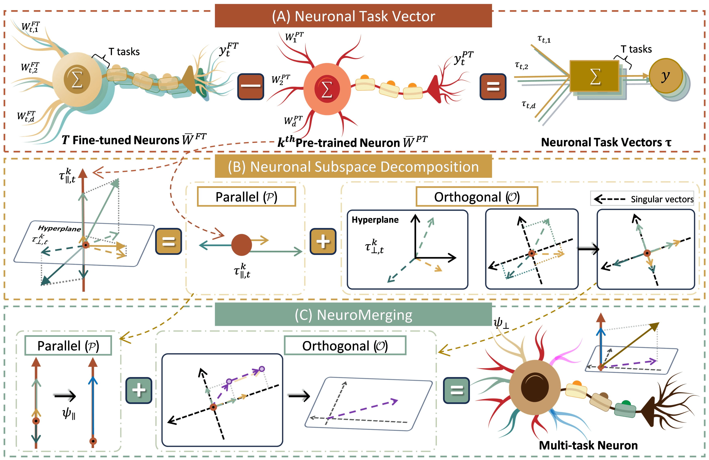
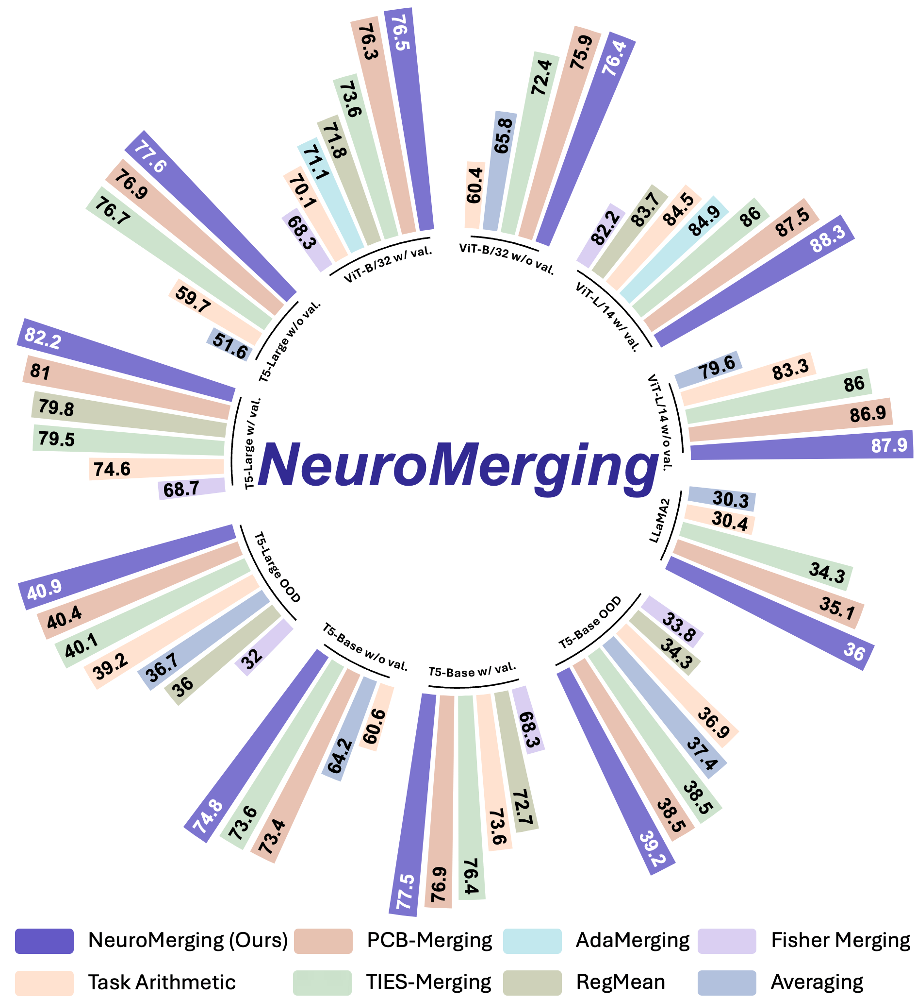
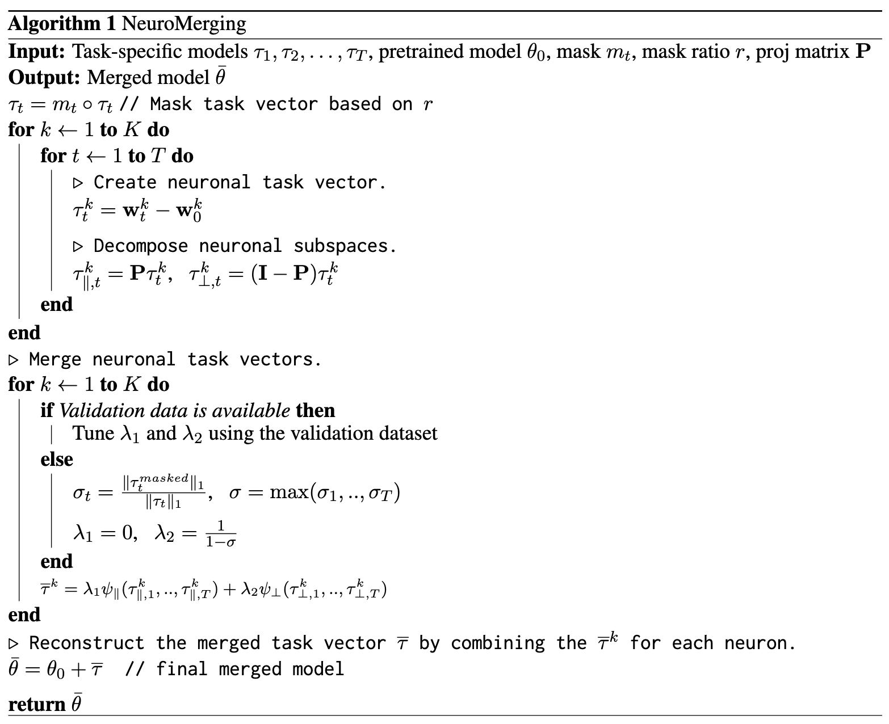

# NeuroMerging

<div align="center">

</div>

A repository of **'[To See a World in a Spark of Neuron: Disentangling Multi-task Interference for Training-free Model Merging (EMNLP 2025)](https://zzzitaofang.github.io/projects/NeuroMerging/)'**.

<!-- <details>
<summary>Abstract</summary> -->

> Fine-tuning pre-trained models on targeted datasets enhances task-specific performance but often comes at the expense of generalization. Model merging techniques, which integrate multiple fine-tuned models into a single multi-task model through task arithmetic, offer a promising solution. However, task interference remains a fundamental challenge, leading to performance degradation and suboptimal merged models. Existing approaches largely overlooked the fundamental roles of neurons, their connectivity, and activation, resulting in a merging process and a merged model that does not consider how neurons relay and process information. In this work, we present the first study that relies on neuronal mechanisms for model merging. Specifically, we decomposed task-specific representations into two complementary neuronal subspaces that regulate input sensitivity and task adaptability. Leveraging this decomposition, we introduced **NeuroMerging**, a novel merging framework developed to mitigate task interference within neuronal subspaces, enabling training-free model fusion across diverse tasks. Through extensive experiments, we demonstrated that NeuroMerging achieved superior performance compared to existing methods on multi-task benchmarks across both natural language and vision domains. Our findings highlighted the importance of aligning neuronal mechanisms in model merging, offering new insights into mitigating task interference and improving knowledge fusion.
<!-- </details> -->

<div align="center">

</div>

<div align="center">
  
  &nbsp;&nbsp;&nbsp;
  
</div>

## Table of Contents
* [Pseudocode](#pseudocode)
* [Merge LLMs](#merge-llms)

## Pseudocode
This section is designed for easier integration of NeuroMerging into your project. All relevant functionalities are implemented in the [NeuroMerging.py](./NeuroMerging.py) file, following the pseudocode in the paper, with detailed comments.

## Merge LLMs

This section covers LLM-series model merging.

This part of module is adapted from the official [MergeLM](https://github.com/yule-BUAA/MergeLM/) repository with modifications. For environment setup and general preparation, please follow the instructions in [MergeLM](https://github.com/yule-BUAA/MergeLM/).

### Dataset Path (CMMLU)

Please update the CMMLU dataset path in:

- `mp_utils.py`
  - **Line 9**: set `PATH_TO_DATA_CMMLU` to your local CMMLU directory

### Two Modes

We provide two workflows:

- **Lite Mode**: no need to tune `lambda_1` (resource-saving)
- **Full Mode**: allows tuning `lambda_1` (full setting)

#### Lite Mode (Fixed `lambda_1`)

1. Please update the pretrained model directory path:

    - `merge_7b.py`
      - **Line 18**: `PT_MODEL_PATH` → set to the folder that contains the pretrained models

    - `inference.py`
      - **Line 44**: `PT_MODEL_PATH` → same as above

2. Switch the code blocks as indicated by the comments in the file `model_merging_methods/merging_methods.py` (The file already contains inline markers indicating which blocks belong to Lite vs Full mode.):

    - **Enable (uncomment)** lines **1188–1194**, **1247–1253**, **1307-1331**.
    - **Disable (comment out)** lines **1196–1202**, **1255-1261**, **1333-1359**.


3. Run merging (You can adjust related arguments and hyperparameters directly inside the corresponding `.sh` scripts).

    ```bash
    bash merge.sh
    ```

4. Run Evaluation

    ```bash
    bash eval.sh
    ```

---

#### Full Mode (Tunable `lambda_1`)

1. Please update the pretrained model directory path:

    - `merge_7b_double.py`
      - **Line 18**: `PT_MODEL_PATH` → set to the folder that contains the pretrained models

    - `inference_double.py`
      - **Line 44**: `PT_MODEL_PATH` → same as above

2. Run merging (As with Lite Mode, all tunable parameters are configured in the corresponding `.sh` scripts).

    ```bash
    bash merge_double.sh
    ```

3. Run Evaluation

    ```bash
    bash eval_double.sh
    ```

## Reference
If you find our paper or this resource helpful, please consider cite:

```bibtex
@inproceedings{fang2025neuromerging,
  title={To See a World in a Spark of Neuron: Disentangling Multi-task Interference for Training-free Model Merging},
  author={Fang, Zitao and Du, Guodong and Yu, Shuyang and Guo, Yifei and Zhang, Yiwei and Cao, Yiyao and Li, Jing and Tang, Ho-Kin and Goh, Sim Kuan},
  booktitle={Proceedings of the 2025 Conference on Empirical Methods in Natural Language Processing (EMNLP)},
  year={2025},
  url={https://arxiv.org/abs/2503.05320}
}
```

## Acknowledgement
Our implementation references the code below, thanks to them.

- TIES-Merging: https://github.com/prateeky2806/ties-merging

- AdaMerging: https://github.com/EnnengYang/AdaMerging
  
- MergeLM: https://github.com/yule-BUAA/MergeLM